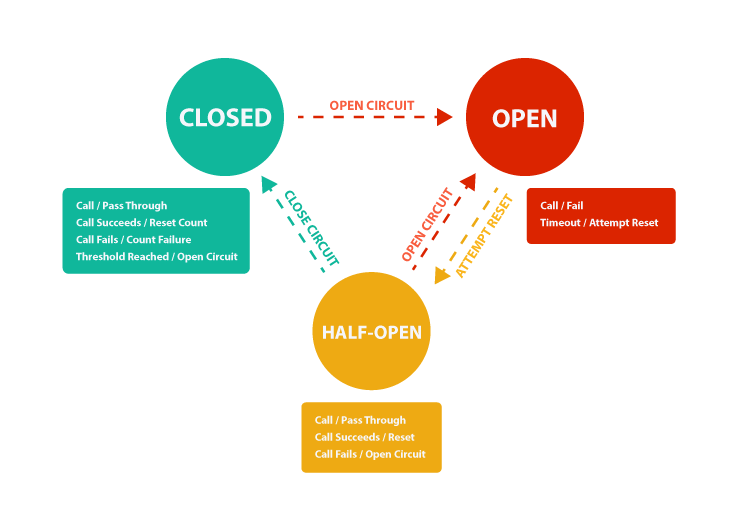
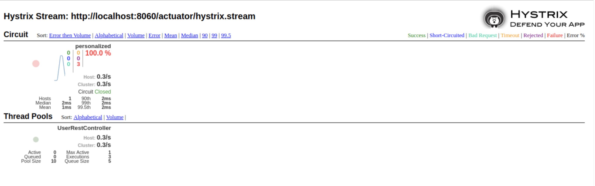

# Circuit breaker
Здесь рассмотрены различные подходы к использованию паттерна "Circuit breaker", 
в том числе решения от ["Hystrix"](https://github.com/Netflix/Hystrix/wiki) и 
["Resilience4j"](https://resilience4j.readme.io/docs)

* [About pattern](#about-pattern)
* [Resilience4j solutions](#resilience4j-solutions)
* [Hystrix solutions](#hystrix-solutions)
* [Eureka naming server, Ribbon, Resilience4j, Feign](#eureka-naming-server-ribbon-resilience4j-feign)
* [Simple example with Feign](#simple-example-with-feign)
* [Hystrix and Feign](#hystrix-and-feign)
* [Used technologies](#used-technologies)

## About pattern
*Circuit breaker* - один из паттернов, применяющийся в микросервисной архитектуре. 
Он позволяет повысить отказоустойчивость системы. Паттерн *Circuit breaker* рассчитан на 
обработку менее ожидаемых ошибок: обрыв сети, недоступность оборудования. В таких ситуациях
шанс получить повторную ошибку довольно высок. Например, приложение взаимодействует с неким сервисом, 
и в рамках реализации запросов и ответов предусмотрен некоторый тайм-аут, по истечении которого, если 
от сервиса не получен ответ, то операция считается неуспешной. В случае проблем с этим сервисом, во время 
ожидания ответа и до достижения тайм-аута приложение может потреблять какие-то критически важные ресурсы 
(память, процессорное время), которые скорее всего нужны другим частям приложения. В такой ситуации, для 
приложения будет предпочтительнее завершить операцию с ошибкой сразу, не дожидаясь тайм-аута от сервиса и 
повторять попытку только тогда, когда вероятность успешного завершения будет достаточно высока.

Паттерн *Circuit breaker* предотвращает попытки приложения выполнить операцию, которая скорее всего 
завершится неудачно, что позволяет продолжить работу дальше не тратя важные ресурсы, пока известно, что проблема 
не устранена. Приложение должно быстро принять сбой операции и обработать его.
Он также позволяет приложению определять, была ли устранена неисправность. Если проблема устранена, 
приложение может попытаться вызвать операцию снова.

у *Circuit breaker*'а бывает три состояния:

1. *Closed*: Запрос приложения перенаправляется на операцию. Прокси-сервер ведет подсчет числа недавних сбоев, 
и если вызов операции не завершился успешно, прокси-сервер увеличивает это число. Если число недавних сбоев превышает 
заданный порог в течение заданного периода времени, прокси-сервер переводится в состояние *Open*. На этом этапе 
прокси-сервер запускает таймер времени ожидания, и по истечении времени этого таймера прокси-сервер переводится в 
состояние *Half-Open*. Цель применения этого паттерна — дать системе время на исправление ошибки, которая вызвала сбой, 
прежде чем разрешить приложению попытаться выполнить операцию еще раз.

2. *Open*: запрос от приложения немедленно завершает с ошибкой и исключение возвращается в приложение.

3. *Half-Open*: Ограниченному числу запросов от приложения разрешено проходить через операцию и вызывать ее. 
Если эти запросы выполняются успешно, предполагается, что ошибка, которая ранее вызывала сбой, устранена, а 
автоматический выключатель переходит в состояние *Closed* (счетчик сбоев сбрасывается). Если какой-либо запрос 
завершается со сбоем, автоматическое выключение предполагает, что неисправность все еще присутствует, поэтому он 
возвращается в состояние *Open* и перезапускает таймер времени ожидания, чтобы дать системе дополнительное время 
на восстановление после сбоя.
Состояние *Half-Open* помогает предотвратить быстрый рост запросов к сервису. Т.к. после начала работы сервиса, 
некоторое время он может быть способен обрабатывать ограниченное число запросов до полного восстановления.

## Resilience4j solutions
[Resilience4j](https://resilience4j.readme.io/docs) - легковесная, простая в использовании библиотека, 
с набором инструментов для повышения отказоустойчивости. Она пришла на замену *Netflix Hystrix* (кто не знал, 
он умер в 2018г). В данной библиотеке представлены следующие фичи:
* [Circuit breaker](https://resilience4j.readme.io/docs/circuitbreaker)
* [Bulkhead](https://resilience4j.readme.io/docs/bulkhead)
* [Rate Limiter](https://resilience4j.readme.io/docs/ratelimiter)
* [Retry](https://resilience4j.readme.io/docs/retry)
* [Time Limiter](https://resilience4j.readme.io/docs/timeout)
* [Cache](https://resilience4j.readme.io/docs/cache)

## Hystrix solutions
[Netflix Hystrix](https://github.com/Netflix/Hystrix/wiki) - - это библиотека, которая помогает вам контролировать 
взаимодействие между распределенными сервисами, добавляя логику устойчивости к задержкам и отказоустойчивости. Hystrix 
делает это, изолируя точки доступа между службами, останавливая каскадные отказы между ними и предоставляя варианты 
восстановления, все из которых улучшают общую отказоустойчивость вашей системы.
(Вот, что сказано на их официальной страничке)

Помимо прочего, у *Hystrix* есть прикольная штучка - *Hystrix dashboard*. Она позволяет визуализировать
метрики, чтобы понять эффективность системы.

(Вот как выглядит дашборд)

## Eureka naming server, Ribbon, Resilience4j, Feign
Перейдем к примерам. В первом примере рассмотрим работу *Circuit breaker*'a совместно с *Feign*, *Eureka naming service*,
*Ribbon*. Здесь будет рассматриваться реализация от *Resilience4j*
#### Subway service

В качестве стороннего сервиса возьмем *Subway-service*. Он обрабатывает два запроса:
на один из них плюется ошибкой, на другой спит (это понадобиться для тестирования time-out'а)

```java
    @GetMapping("/subway/stations/exception")
    public SubwayStationDto getAllStationsException() {
        throw new IllegalArgumentException("little exception:(");
    }

    @GetMapping("/subway/stations/timeout")
    public SubwayStationDto getAllStationsTimeout() {
        try {
            Thread.sleep(10000);
        } catch (InterruptedException e) {
            log.error("wtf cant sleep...");
        }
        return SubwayStationDto.builder()
                .subwayStations(Arrays.asList("Кремлевская", "Площадь Тукая", "Суконная слобода", "Аметьево"))
                .build();
    }
```

Для работы с *Eureka Naming Server* добавим:
Аннотацию на *main class* :
````java
@EnableDiscoveryClient
@SpringBootApplication
public class SubwayServiceApplication {

	public static void main(String[] args) {
		SpringApplication.run(SubwayServiceApplication.class, args);
	}
}
````
Зависимость в *pom.xml*
````xml
		<dependency>
			<groupId>org.springframework.cloud</groupId>
			<artifactId>spring-cloud-starter-netflix-eureka-client</artifactId>
		</dependency>
````

в *application.properties* URL к *Eureka server*

````properties
eureka.client.service-url.default-zone=http://localhost:8761/eureka
````

#### Eureka naming server
Настроим *Eureka server* (ничего интересного, самый дефолтный сервер)

*Main.class* 
````java
@EnableEurekaServer
@SpringBootApplication
public class EurekaNamingServiceApplication {
	public static void main(String[] args) {
		SpringApplication.run(EurekaNamingServiceApplication.class, args);
	}
}
````

*application.properties*
````properties
spring.application.name=netflix-eureka-naming-server
server.port=8761

eureka.client.register-with-eureka=false
eureka.client.fetch-registry=false
````

#### Circuit breaker service
Ммммм...)) то, ради чего мы здесь собрались. 

Будем разбирать, как настраивать *Feign Client*. 

Добавляем следующие аннотации в *Main.class*
````java
@SpringBootApplication
@EnableFeignClients
@EnableConfigurationProperties
@EnableEurekaClient
@RibbonClient(name = "subway-service")
public class CircuitBreakerApplication {
    public static void main(String[] args) {
        SpringApplication.run(CircuitBreakerApplication.class, args);
    }
}
````

*@EnableFeignClients* - для работы с *Feign clients*
*@EnableEurekaClient* - для работы с *Eureka server*
*@RibbonClient* - для работы с *Ribbon*

Для работы с *Circuit Breaker*'ом нам понадобиться добавить класс конфигурации
в аннотацию *@FeignClient* 

````java
@FeignClient(value = SubwayFeignService.SERVICE_NAME,
             configuration = SubwayFeignServiceConfiguration.class)
public interface SubwayFeignService {

    String SERVICE_NAME = "subway-service";

    @GetMapping("/subway/stations/exception")
    @CircuitBreaker(name = SERVICE_NAME)
    SubwayStationDto getAllStationsException();

    @GetMapping("/subway/stations/timeout")
    @CircuitBreaker(name = SERVICE_NAME)
    SubwayStationDto getAllStationsTimeout();

}
````

в классе конфигурации объявляем *Feign.Builder* и в *FeignDecorator* передаем наши *Circuit Breaker*,
 *FallBack*.
 
*FallBack* - позволяет определить поведение при возникновении ошибки.

````java
@RequiredArgsConstructor
@Configuration
public class SubwayFeignServiceConfiguration {

    private final CircuitBreakerRegistry registry;
    private final FallbackSubwayFeignService fallbackSubwayFeignService;

    @Bean
    @Scope("prototype")
    public Feign.Builder feignBuilder() {
        CircuitBreaker circuitBreaker = registry.circuitBreaker(SubwayFeignService.SERVICE_NAME);
        FeignDecorators decorators = FeignDecorators.builder()
                .withCircuitBreaker(circuitBreaker)
                .withFallback(fallbackSubwayFeignService)
                .build();
        return Resilience4jFeign.builder(decorators);
    }
}

````

Также необходимо сконфигурировать *CircuitBreaker*. Я вынесла все настройки в файл *application.properties*
````properties
spring.application.name=subway-info-service
server.port=8081
eureka.client.service-url.default-zone=http://localhost:8761/eureka

ribbon.eureka.enabled=false
spring.cloud.loadbalancer.ribbon.enabled=false

resilience4j.circuitbreaker.configs.default.slowCallDurationThreshold=1000
resilience4j.circuitbreaker.configs.default.failureRateThreshold=50
resilience4j.circuitbreaker.configs.default.sliding-window-type=COUNT_BASED
resilience4j.circuitbreaker.configs.default.slidingWindowSize=3
resilience4j.circuitbreaker.configs.default.minimumNumberOfCalls=5
resilience4j.circuitbreaker.configs.default.waitDurationInOpenState=60s

resilience4j.circuitbreaker.configs.default.registerHealthIndicator=true
resilience4j.circuitbreaker.configs.default.permittedNumberOfCallsInHalfOpenState=1
resilience4j.circuitbreaker.configs.default.automaticTransitionFromOpenToHalfOpenEnabled=true
resilience4j.circuitbreaker.configs.default.eventConsumerBufferSize=10

feign.client.config.default.connectTimeout=60000
feign.client.config.default.readTimeout=1000
````

## Simple example with Feign

В этом примере не будет использоваться *Eureka Naming Server* и *Ribbon*
Здесь рассмотрен пример, как в одном часть *FeignClient*'ов настроить с использованием
*CircuitBreaker*, а часть без него.

(circuit-breaker-without-eureka-server)

## Hystrix and Feign

В этом примере показано как воспользоваться *Circuit Breaker*'ом от  *Netflix Hystrix*
(Не забываем, что он DEPRECATED!!)

(hystrix-circuit-breaker)

## Used technologies
* [Feign Clients](https://docs.spring.io/spring-cloud-openfeign/docs/current/reference/html/)
* [Eureka](https://github.com/Netflix/eureka)
* [Ribbon](https://github.com/Netflix/ribbon)
* [Resilience4j](https://resilience4j.readme.io/docs)
* [Hystrix](https://github.com/Netflix/Hystrix)
